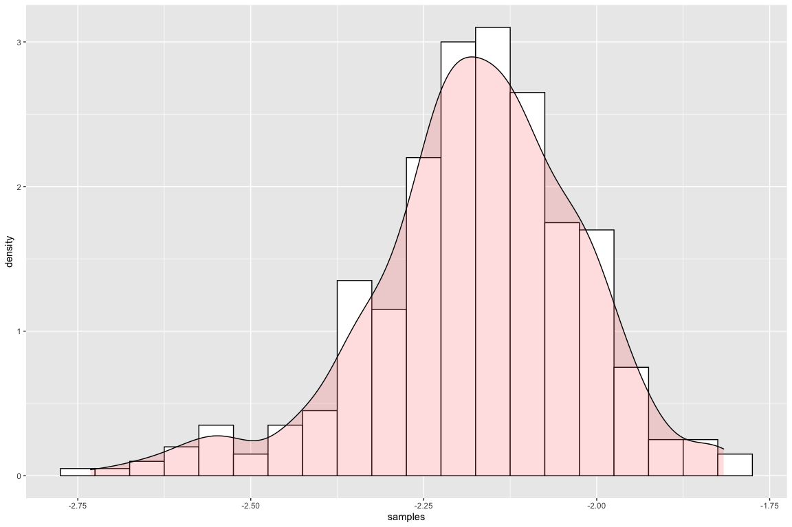

# Comments
Still to do

* Add basin depth scaling
* add default values for magnitude break point
* add some checks for inputs to function
* add some example calculations/plots
* maybe move reading of coefficients from inside the function to beginning, so that it is not repeated in every function call
* Overall, the implementation is probably not very efficient

# Introduction

This is demonstration of an implementation of the KBCG19 NGA subduction model.
The code can be run using the **R** programming language.

# Set Up

First, we load the needed libraries.


```r
# load required packages
library(MASS)
```

# Define Functions

## Helper Functions
First, some functions that are needed to do some internal calculations.


```r
# logistc hinge function
loghinge <- function(x, x0, a, b0, b1, delta) {
  return(a + b0 * (x - x0) + (b1 - b0) * delta * log(1 + exp((x - x0)/delta)))
}

# interpolation of adjustment to magnitude break point
interp_dmb <- function(period) {
  ap <- approxfun(c(log(0.01),log(1),log(3),log(10)), c(0,0,-0.4,-0.4), rule = 2)
  
  if(period == 0) {
    return (ap(log(0.01)))
  }
  else {
    return (ap(log(period)))
  }
}

# interpolation of k1/k2 (values taken from Campbell and Bozorgnia (2014)
interp_k1k2 <- function(period) {
  periods <- c(0.005, 0.01, 0.02, 0.03, 0.05, 0.075, 0.1, 0.15, 0.2, 0.25, 0.3, 0.4, 0.5, 0.75,
               1., 1.5, 2., 3., 4., 5., 7.5, 10.)
  k1 <- c(865., 865., 865., 908., 1054., 1086., 1032., 878., 748., 654., 587., 503., 457., 410.,
          400., 400., 400., 400., 400., 400., 400., 400.)
  k2 <- c(-1.186, -1.186, -1.219, -1.273, -1.346, -1.471, -1.624, -1.931, -2.188, -2.381, -2.518,
          -2.657, -2.669, -2.401, -1.955, -1.025, -0.299, 0., 0., 0., 0., 0.)
  
  ap_k1 <- approxfun(log(periods), k1, rule = 2)
  ap_k2 <- approxfun(log(periods), k2, rule = 2)
  
  if(period == 0) {
    return (c(ap_k1(log(0.005)),ap_k2(log(0.005))))
  }
  else {
    return (c(ap_k1(log(period)),ap_k2(log(period))))
  }
}

# funcation to calculate Z_1/Z_2_5 from Vs30
calc_z_from_vs <- function(vs, coeffs) {
  zref <- coeffs[1] + (coeffs[2] - coeffs[1]) * exp((log(vs) - coeffs[3]) / coeffs[4]) / 
    (1 + exp((log(vs) - coeffs[3]) / coeffs[4]))
  
  return (zref)
}
```

## Function to calculate median prediction

The following function calculates the median prediction of KBCG19, as described in chapter 4 of the PEER report.
It takes as input the predictor variables, as well as a set of coefficients.
Later, we define a function that acts as a wrapper around this function, and will take as input period, region index, and then select the appropriate coefficient and pass them on.

The inputs are

* `m`: moment magnitude
* `rlist`: a vector of length 3, which contains the distance in subregion 1,2,3 relative to volcanic arc; `rlist <- c(R1,R2,R3)`. Typically, $R1=R3=0$ (corresponding to forearc).
* `ztor`: depth to top of rupture in km.
* `fs`: flag for interface (`fs <- 0`) and intraslab (`fs <- 1`). Must be 0 or 1.
* `vs`: $V_{S30}$ n m/s.
* `fx`: arc crossing flag. Must be 0 or 1.
* `delta_ln_z`: difference between natural log of observed Z1.0/Z2.5 value and reference Z1.0/Z2.5 from $V_{S30}$.
* `coeffs`: vector containing coefficients needed to calculate median prediction.
* `coeffs_attn`: vector of length 6 to calcualte anelastic attenuation.
* `mbreak` and `zbreak`: magnitude and depth scaling break point
* `k1` and `k2`: parameters needed for site amplification
* `nft1` and `nft2`: coefficients needed for pseudo-depth term.
* `pgarock`: median pga prediction at $V_{S30} = 1100$


```r
# function to calculate median prediction
kbcg19_med <- function(m, rlist, ztor, fs, vs, fx, delta_ln_z, coeffs, coeffs_attn, coeffs_z, mbreak, zbreak, 
                        k1, k2, nft1, nft2, pgarock) {
  
  rrup = sum(rlist);
  theta10 = 0;
  vsrock = 1100;
  c = 1.88;
  n = 1.18;
  minmb = 6.;
  delta = 0.1;
  deltaz = 1;
  refzif = 15;
  refzslab = 50;
  
  
  
  fmag = (1 - fs) * loghinge(m, mbreak, coeffs[6] * (mbreak - minmb), coeffs[6], coeffs[8], delta) + 
         fs * loghinge(m, mbreak, coeffs[7] * (mbreak - minmb), coeffs[7], coeffs[8], delta)
  
  fgeom = (1 - fs) * (coeffs[3] + coeffs[5] * m) * log(rrup + 10^(nft1 + nft2 * (m - 6)))
  fgeom_slab = fs * (coeffs[4] + coeffs[5] * m) * log(rrup + 10^(nft1 + nft2 * (m - 6)))
  
  fdepth = (1 - fs) * loghinge(ztor, zbreak, coeffs[12] * (zbreak - refzif), coeffs[12], theta10, deltaz) + 
           fs * loghinge(ztor, zbreak, coeffs[13] * (zbreak - refzslab), coeffs[12], theta10, deltaz)
  
  fattn = fx * as.numeric(rlist %*% coeffs_attn[c(1,2,3)]) + (1 - fx) * as.numeric(rlist %*% coeffs_attn[c(4,5,6)]) + fx * coeffs[14]
  
  if(vs < k1) {
    fsite = coeffs[11] * log(vs / k1) + k2 * (log(pgarock + c * (vs / k1)^n) - log(pgarock + c))
  } else {
    fsite = (coeffs[11] + k2 * n) * log(vs/k1)
  }
  
  fbasin <- coeffs_z[1] + coeffs_z[2] * delta_ln_z
  
  median = (1 - fs) * coeffs[1] + fs * coeffs[2] + fmag + fgeom + fgeom_slab + fdepth + fattn + fsite + fbasin;
  return(median)
}
```

## Function to calculate median prediction for a given scenario and period
This is a function that calculates median predictions of KBCG19 for a given scenario.
I takes as input period, the predictor variables for the scenarios, selects the appropriate coefficients/parameters, and calls the function defined in the previous section.

Last input is a region index `reg`, which is as follows:

* 0: global
* 1: Alaska
* 2: Cascadia
* 3: Central America & Mexico
* 4: Japan
* 5: New Zealand
* 6: South America
* 7: Taiwan


```r
# function to calculate median prediction using mean coefficients
kbcg19 <- function(period, m, rlist, ztor, fs, vs, z_1, z_2_5, fx, mb, reg, Seattle_Basin = FALSE) {
  # need to add some checks for input (period, region)
  
  # coefficients to calculate zref from vs30
  pars_z_ja <- c(7.689368537500001, 2.302585092994046, 6.309186400000001, 0.7528670225000001, 1.2952369625)
  pars_z_casc <- c(8.294049640102028, 2.302585092994046, 6.396929655216146, 0.27081458999999997, 1.7381352625)
  pars_z_nz <- c(6.859789675000001, 2.302585092994046, 5.745692775, 0.91563524375, 1.03531412375)
  pars_z_tw <- c(6.30560665, 2.302585092994046, 6.1104992125, 0.43671101999999995, 0.7229702975000001)
  
  parameters <- read.csv('/Users/nico/GROUNDMOTION/PROJECTS/SUBDUCTION/CBGK/STAN_V16/RESULTS/parameters_allregca_attn3_corrreg_cs_dmb_smoothed_gprf.csv')
  parameters_zmod <- read.csv('/Users/nico/GROUNDMOTION/PROJECTS/SUBDUCTION/CBGK/STAN_V16/RESULTS/parameters_Z_ALL_allregca_attn3_corrreg_cs_dmb.csv')
  
  # calculate rock PGA
  vsrock = 1100
  pars_period <- as.numeric(parameters[parameters$T == 0.,])
  coeffs <- pars_period[seq(2,15)]
  k1k2 <- interp_k1k2(0.)
  dmb <- interp_dmb(0.)
  
  if(reg == 1) {
    coeffs[c(1,2,11)] = pars_period[c(17, 24, 31)]
    coeffs_attn = pars_period[c(38, 45, 52, 59, 66, 73)]
    delta_ln_z <- 0
    coeffs_z <- c(0,0)
  } else if(reg == 2) {
    coeffs[c(1,2,11)] = pars_period[c(18, 25, 32)]
    coeffs_attn = pars_period[c(39, 46, 53, 60, 67, 74)]
    delta_ln_z <- 0
    coeffs_z <- c(0,0)
  } else if(reg == 3) {
    coeffs[c(1,2,11)] = pars_period[c(19, 26, 33)]
    coeffs_attn = pars_period[c(40, 47, 54, 61, 68, 75)]
    delta_ln_z <- 0
    coeffs_z <- c(0,0)
  } else if(reg == 4) {
    coeffs[c(1,2,11)] = pars_period[c(20, 27, 34)]
    coeffs_attn = pars_period[c(41, 48, 55, 62, 69, 76)]
    delta_ln_z <- 0
    coeffs_z <- c(0,0)
  } else if(reg == 5) {
    coeffs[c(1,2,11)] = pars_period[c(21, 28, 35)]
    coeffs_attn = pars_period[c(42, 49, 56, 63, 70, 77)]
    delta_ln_z <- 0
    coeffs_z <- c(0,0)
  } else if(reg == 6) {
    coeffs[c(1,2,11)] = pars_period[c(22, 29, 36)]
    coeffs_attn = pars_period[c(43, 50, 57, 64, 71, 78)]
    delta_ln_z <- 0
    coeffs_z <- c(0,0)
  } else if(reg == 7) {
    coeffs[c(1,2,11)] = pars_period[c(23, 30, 37)]
    coeffs_attn = pars_period[c(44, 51, 58, 65, 72, 79)]
    delta_ln_z <- 0
    coeffs_z <- c(0,0)
  }
  delta_bz <- pars_period[c(80,81)]
  coeffs_nft <- pars_period[c(82,83)]
  
  mbreak = (1 - fs) * (mb + dmb) + fs * mb
  zbreak = (1 - fs) * (30 + delta_bz[1]) + fs * (80 + delta_bz[2])
  
  pgarock <- exp(kbcg19_med(m, rlist, ztor, fs, vsrock, fx, delta_ln_z, coeffs, coeffs_attn, coeffs_z, mbreak, zbreak, 
             k1k2[1], k1k2[2], coeffs_nft[1], coeffs_nft[2], 0))
  # print(pgarock)
  
  
  # calculate PSA
  pars_period <- as.numeric(parameters[parameters$T == period,])
  coeffs <- pars_period[seq(2,15)]
  k1k2 <- interp_k1k2(period)
  dmb <- interp_dmb(period)
  
  if(reg == 1) {
    coeffs[c(1,2,11)] = pars_period[c(17, 24, 31)]
    coeffs_attn = pars_period[c(38, 45, 52, 59, 66, 73)]
    delta_ln_z <- 0
    coeffs_z <- c(0,0)
  } else if(reg == 2) {
    coeffs[c(1,2,11)] = pars_period[c(18, 25, 32)]
    coeffs_attn = pars_period[c(39, 46, 53, 60, 67, 74)]
    delta_ln_z <- log(z_2_5) - calc_z_from_vs(log(vs), pars_z_casc)
    coeffs_z <- as.numeric(parameters_zmod[parameters_zmod$T == period,c(2,3)])
    coeff_seattle <- parameters_zmod[parameters_zmod$T == period,]$mean_residual_Seattle_basin
    if(Seattle_Basin) {
      coeffs_z = c(coeff_seattle,0)
    }
  } else if(reg == 3) {
    coeffs[c(1,2,11)] = pars_period[c(19, 26, 33)]
    coeffs_attn = pars_period[c(40, 47, 54, 61, 68, 75)]
    delta_ln_z <- 0
    coeffs_z <- c(0,0)
  } else if(reg == 4) {
    coeffs[c(1,2,11)] = pars_period[c(20, 27, 34)]
    coeffs_attn = pars_period[c(41, 48, 55, 62, 69, 76)]
    delta_ln_z <- log(z_2_5) - calc_z_from_vs(log(vs), pars_z_ja)
    coeffs_z <- as.numeric(parameters_zmod[parameters_zmod$T == period,c(5,6)])
  } else if(reg == 5) {
    coeffs[c(1,2,11)] = pars_period[c(21, 28, 35)]
    coeffs_attn = pars_period[c(42, 49, 56, 63, 70, 77)]
    delta_ln_z <- log(z_1) - calc_z_from_vs(log(vs), pars_z_nz)
    coeffs_z <- as.numeric(parameters_zmod[parameters_zmod$T == period,c(7,8)])
  } else if(reg == 6) {
    coeffs[c(1,2,11)] = pars_period[c(22, 29, 36)]
    coeffs_attn = pars_period[c(43, 50, 57, 64, 71, 78)]
    delta_ln_z <- 0
    coeffs_z <- c(0,0)
  } else if(reg == 7) {
    coeffs[c(1,2,11)] = pars_period[c(23, 30, 37)]
    coeffs_attn = pars_period[c(44, 51, 58, 65, 72, 79)]
    delta_ln_z <- log(z_1) - calc_z_from_vs(log(vs), pars_z_tw)
    coeffs_z <- as.numeric(parameters_zmod[parameters_zmod$T == period,c(9,10)])
  }
  delta_bz <- pars_period[c(80,81)]
  coeffs_nft <- pars_period[c(82,83)]
  
  mbreak = (1 - fs) * (mb + dmb) + fs * mb
  zbreak = (1 - fs) * (30 + delta_bz[1]) + fs * (80 + delta_bz[2])
  
  med <- kbcg19_med(m, rlist, ztor, fs, vs, fx, delta_ln_z, coeffs, coeffs_attn, coeffs_z, mbreak, zbreak, 
                            k1k2[1], k1k2[2], coeffs_nft[1], coeffs_nft[2], pgarock)
  return(med)
}
```


## Function to calculate distribution of median predictions (for epistemic uncertainty)

Similar as in previous section, but reads in posterior distribution, and loops over samples from posterior.
The number of samples can be set, with 800 as default.
Output is mean/mdain/5%,25%,75%,95% quntiles of distribution, and the median predictions themselves.
Two functions are defined.
The first calculates predictions for the global model using presampled adjustment coefficients for a new region, while the second one samples these internally (this function is implemented to demonstrate how to perform the sampling, but to get reproducible results, one should use the one wth presampled coefficients).


```r
# function to calculate median prediction using posterior distributions
# still need to add basin depth term
kbcg19_posterior <- function(period, m, rlist, ztor, fs, vs, z_1, z_2_5, fx, mb, reg, num_samples = 100, Seattle_Basin = FALSE) {
  # need to add some checks for input (period, region)
  
  # coefficients to calculate zref from vs30
  pars_z_ja <- c(7.689368537500001, 2.302585092994046, 6.309186400000001, 0.7528670225000001, 1.2952369625)
  pars_z_casc <- c(8.294049640102028, 2.302585092994046, 6.396929655216146, 0.27081458999999997, 1.7381352625)
  pars_z_nz <- c(6.859789675000001, 2.302585092994046, 5.745692775, 0.91563524375, 1.03531412375)
  pars_z_tw <- c(6.30560665, 2.302585092994046, 6.1104992125, 0.43671101999999995, 0.7229702975000001)
  
  parameters <- read.csv('/Users/nico/GROUNDMOTION/PROJECTS/SUBDUCTION/CBGK/STAN_V16/RESULTS/parameters_allregca_attn3_corrreg_cs_dmb.csv')
  parameters_zmod <- read.csv('/Users/nico/GROUNDMOTION/PROJECTS/SUBDUCTION/CBGK/STAN_V16/RESULTS/parameters_Z_ALL_allregca_attn3_corrreg_cs_dmb.csv')
  
  # calculate rock PGA
  vsrock = 1100
  pars_period <- as.numeric(parameters[parameters$T == 0.,])
  coeffs <- pars_period[seq(2,15)]
  k1k2 <- interp_k1k2(0.)
  dmb <- interp_dmb(0.)
  
  if(reg == 1) {
    coeffs[c(1,2,11)] = pars_period[c(17, 24, 31)]
    coeffs_attn = pars_period[c(38, 45, 52, 59, 66, 73)]
    delta_ln_z <- 0
    coeffs_z <- c(0,0)
  } else if(reg == 2) {
    coeffs[c(1,2,11)] = pars_period[c(18, 25, 32)]
    coeffs_attn = pars_period[c(39, 46, 53, 60, 67, 74)]
    delta_ln_z <- 0
    coeffs_z <- c(0,0)
  } else if(reg == 3) {
    coeffs[c(1,2,11)] = pars_period[c(19, 26, 33)]
    coeffs_attn = pars_period[c(40, 47, 54, 61, 68, 75)]
    delta_ln_z <- 0
    coeffs_z <- c(0,0)
  } else if(reg == 4) {
    coeffs[c(1,2,11)] = pars_period[c(20, 27, 34)]
    coeffs_attn = pars_period[c(41, 48, 55, 62, 69, 76)]
    delta_ln_z <- 0
    coeffs_z <- c(0,0)
  } else if(reg == 5) {
    coeffs[c(1,2,11)] = pars_period[c(21, 28, 35)]
    coeffs_attn = pars_period[c(42, 49, 56, 63, 70, 77)]
    delta_ln_z <- 0
    coeffs_z <- c(0,0)
  } else if(reg == 6) {
    coeffs[c(1,2,11)] = pars_period[c(22, 29, 36)]
    coeffs_attn = pars_period[c(43, 50, 57, 64, 71, 78)]
    delta_ln_z <- 0
    coeffs_z <- c(0,0)
  } else if(reg == 7) {
    coeffs[c(1,2,11)] = pars_period[c(23, 30, 37)]
    coeffs_attn = pars_period[c(44, 51, 58, 65, 72, 79)]
    delta_ln_z <- 0
    coeffs_z <- c(0,0)
  } else if(reg == 0) {
    coeffs[c(1,2,11)] = pars_period[c(172, 173, 174)]
    coeffs_attn = pars_period[c(175, 176, 177, 178, 179, 180)]
    
    delta_ln_z <- 0
    coeffs_z <- c(0,0)
  }
  
  
  delta_bz <- pars_period[c(80,81)]
  coeffs_nft <- pars_period[c(82,83)]
  
  mbreak = (1 - fs) * (mb + dmb) + fs * mb
  zbreak = (1 - fs) * (30 + delta_bz[1]) + fs * (80 + delta_bz[2])
  
  pgarock <- exp(kbcg19_med(m, rlist, ztor, fs, vsrock, fx, delta_ln_z, coeffs, coeffs_attn, coeffs_z, mbreak, zbreak, 
                            k1k2[1], k1k2[2], coeffs_nft[1], coeffs_nft[2], 0))
  # print(pgarock)
  
  
  # calculate PSA
  parameters_posterior <- read.csv(sprintf('/Users/nico/GROUNDMOTION/PROJECTS/SUBDUCTION/CBGK/STAN_V16/RESULTS/CSV_allregca_attn3_corrreg_cs_dmb_smoothed_gprf/coefficients_KBCG19_global_smoothed_gprf_T%05.2f.csv',period))
  k1k2 <- interp_k1k2(period)
  dmb <- interp_dmb(period)
  
  med_predictions <- matrix(nrow = num_samples, ncol = 1)
  
  for(k in 1:num_samples) {
    pars_period <- as.numeric(parameters_posterior[k,])
    coeffs <- pars_period[seq(2,15)]
  
    if(reg == 1) {
      coeffs[c(1,2,11)] = pars_period[c(17, 24, 31)]
      coeffs_attn = pars_period[c(38, 45, 52, 59, 66, 73)]
      delta_ln_z <- 0
      coeffs_z <- c(0,0)
    } else if(reg == 2) {
      coeffs[c(1,2,11)] = pars_period[c(18, 25, 32)]
      coeffs_attn = pars_period[c(39, 46, 53, 60, 67, 74)]
      delta_ln_z <- log(z_2_5) - calc_z_from_vs(log(vs), pars_z_casc)
      coeffs_z <- as.numeric(parameters_zmod[parameters_zmod$T == period,c(2,3)])
      coeff_seattle <- parameters_zmod[parameters_zmod$T == period,]$mean_residual_Seattle_basin
      if(Seattle_Basin) {
        coeffs_z = c(coeff_seattle,0)
      }
    } else if(reg == 3) {
      coeffs[c(1,2,11)] = pars_period[c(19, 26, 33)]
      coeffs_attn = pars_period[c(40, 47, 54, 61, 68, 75)]
      delta_ln_z <- 0
      coeffs_z <- c(0,0)
    } else if(reg == 4) {
      coeffs[c(1,2,11)] = pars_period[c(20, 27, 34)]
      coeffs_attn = pars_period[c(41, 48, 55, 62, 69, 76)]
      delta_ln_z <- log(z_2_5) - calc_z_from_vs(log(vs), pars_z_ja)
      coeffs_z <- as.numeric(parameters_zmod[parameters_zmod$T == period,c(5,6)])
    } else if(reg == 5) {
      coeffs[c(1,2,11)] = pars_period[c(21, 28, 35)]
      coeffs_attn = pars_period[c(42, 49, 56, 63, 70, 77)]
      delta_ln_z <- log(z_1) - calc_z_from_vs(log(vs), pars_z_nz)
      coeffs_z <- as.numeric(parameters_zmod[parameters_zmod$T == period,c(7,8)])
    } else if(reg == 6) {
      coeffs[c(1,2,11)] = pars_period[c(22, 29, 36)]
      coeffs_attn = pars_period[c(43, 50, 57, 64, 71, 78)]
      delta_ln_z <- 0
      coeffs_z <- c(0,0)
    } else if(reg == 7) {
      coeffs[c(1,2,11)] = pars_period[c(23, 30, 37)]
      coeffs_attn = pars_period[c(44, 51, 58, 65, 72, 79)]
      delta_ln_z <- log(z_1) - calc_z_from_vs(log(vs), pars_z_tw)
      coeffs_z <- as.numeric(parameters_zmod[parameters_zmod$T == period,c(9,10)])
    } else if(reg == 0) {
      coeffs[c(1,2,11)] = pars_period[c(172, 173, 174)]
      coeffs_attn = pars_period[c(175, 176, 177, 178, 179, 180)]
      
      delta_ln_z <- 0
      coeffs_z <- c(0,0)
    }
    
    
    delta_bz <- pars_period[c(80,81)]
    coeffs_nft <- pars_period[c(82,83)]
  
    mbreak = (1 - fs) * (mb + dmb) + fs * mb
    zbreak = (1 - fs) * (30 + delta_bz[1]) + fs * (80 + delta_bz[2])
  
    med <- kbcg19_med(m, rlist, ztor, fs, vs, fx, delta_ln_z, coeffs, coeffs_attn, coeffs_z, mbreak, zbreak, 
                      k1k2[1], k1k2[2], coeffs_nft[1], coeffs_nft[2], pgarock)
    med_predictions[k] <- med
  }
  result <- list(mean = mean(med_predictions), median = median(med_predictions), psi = sd(med_predictions),
                 qu_05 = as.numeric(quantile(med_predictions,0.05)), qu_25 = as.numeric(quantile(med_predictions,0.25)),
                 qu_75 = as.numeric(quantile(med_predictions,0.75)), qu_95 = as.numeric(quantile(med_predictions,0.95)),
                 samples = med_predictions)
  return(result)
}

# function to calculate median prediction using posterior distributions with explicit sampling from global distribution (calculation of covariance matrix and sampling)
kbcg19_posterior_sample <- function(period, m, rlist, ztor, fs, vs, z_1, z_2_5, fx, mb, reg, num_samples = 100, Seattle_Basin = FALSE) {
  # need to add some checks for input (period, region)
  
  # coefficients to calculate zref from vs30
  pars_z_ja <- c(7.689368537500001, 2.302585092994046, 6.309186400000001, 0.7528670225000001, 1.2952369625)
  pars_z_casc <- c(8.294049640102028, 2.302585092994046, 6.396929655216146, 0.27081458999999997, 1.7381352625)
  pars_z_nz <- c(6.859789675000001, 2.302585092994046, 5.745692775, 0.91563524375, 1.03531412375)
  pars_z_tw <- c(6.30560665, 2.302585092994046, 6.1104992125, 0.43671101999999995, 0.7229702975000001)
  
  parameters <- read.csv('/Users/nico/GROUNDMOTION/PROJECTS/SUBDUCTION/CBGK/STAN_V16/RESULTS/parameters_allregca_attn3_corrreg_cs_dmb_smoothed_gprf.csv')
  parameters_zmod <- read.csv('/Users/nico/GROUNDMOTION/PROJECTS/SUBDUCTION/CBGK/STAN_V16/RESULTS/parameters_Z_ALL_allregca_attn3_corrreg_cs_dmb.csv')
  
  # calculate rock PGA
  vsrock = 1100
  pars_period <- as.numeric(parameters[parameters$T == 0.,])
  coeffs <- pars_period[seq(2,15)]
  k1k2 <- interp_k1k2(0.)
  dmb <- interp_dmb(0.)
  
  if(reg == 1) {
    coeffs[c(1,2,11)] = pars_period[c(17, 24, 31)]
    coeffs_attn = pars_period[c(38, 45, 52, 59, 66, 73)]
    delta_ln_z <- 0
    coeffs_z <- c(0,0)
  } else if(reg == 2) {
    coeffs[c(1,2,11)] = pars_period[c(18, 25, 32)]
    coeffs_attn = pars_period[c(39, 46, 53, 60, 67, 74)]
    delta_ln_z <- 0
    coeffs_z <- c(0,0)
  } else if(reg == 3) {
    coeffs[c(1,2,11)] = pars_period[c(19, 26, 33)]
    coeffs_attn = pars_period[c(40, 47, 54, 61, 68, 75)]
    delta_ln_z <- 0
    coeffs_z <- c(0,0)
  } else if(reg == 4) {
    coeffs[c(1,2,11)] = pars_period[c(20, 27, 34)]
    coeffs_attn = pars_period[c(41, 48, 55, 62, 69, 76)]
    delta_ln_z <- 0
    coeffs_z <- c(0,0)
  } else if(reg == 5) {
    coeffs[c(1,2,11)] = pars_period[c(21, 28, 35)]
    coeffs_attn = pars_period[c(42, 49, 56, 63, 70, 77)]
    delta_ln_z <- 0
    coeffs_z <- c(0,0)
  } else if(reg == 6) {
    coeffs[c(1,2,11)] = pars_period[c(22, 29, 36)]
    coeffs_attn = pars_period[c(43, 50, 57, 64, 71, 78)]
    delta_ln_z <- 0
    coeffs_z <- c(0,0)
  } else if(reg == 7) {
    coeffs[c(1,2,11)] = pars_period[c(23, 30, 37)]
    coeffs_attn = pars_period[c(44, 51, 58, 65, 72, 79)]
    delta_ln_z <- 0
    coeffs_z <- c(0,0)
  } else if(reg == 0) {
    sigma_reg <- pars_period[c(86,87,88,89,90)]
    l_mat <- matrix(nrow = 9, ncol = 9)
    l_mat[1,] <- pars_period[91:99]
    l_mat[2,] <- pars_period[100:108]
    l_mat[3,] <- pars_period[109:117]
    l_mat[4,] <- pars_period[118:126]
    l_mat[5,] <- pars_period[127:135]
    l_mat[6,] <- pars_period[136:144]
    l_mat[7,] <- pars_period[145:153]
    l_mat[8,] <- pars_period[154:162]
    l_mat[9,] <- pars_period[163:171]
    corr_reg <- t(l_mat) %*% l_mat
    cov_reg <- diag(sigma_reg[c(1, 2, 5, 4, 4, 4, 4, 3, 4)]) %*% corr_reg %*% diag(sigma_reg[c(1, 2, 5, 4, 4, 4, 4, 3, 4)]) + diag(rep(10^-9,9))
    for(i in 1:9) {
      for(j in i:9) {
        cov_reg[j,i] <- cov_reg[i,j]
      }
    }
    mu <- pars_period[c(2, 3, 12, 11, 11, 11, 11, 10, 11)]
    sample <- mvrnorm(mu = mu,Sigma = cov_reg)
    coeffs[c(1,2,11)] <- sample[c(1,2,3)]
    coeffs_attn <- sample[c(4,5,6,7,8,9)]
    
    delta_ln_z <- 0
    coeffs_z <- c(0,0)
  }
  
  
  delta_bz <- pars_period[c(80,81)]
  coeffs_nft <- pars_period[c(82,83)]
  
  mbreak = (1 - fs) * (mb + dmb) + fs * mb
  zbreak = (1 - fs) * (30 + delta_bz[1]) + fs * (80 + delta_bz[2])
  
  pgarock <- exp(kbcg19_med(m, rlist, ztor, fs, vsrock, fx, delta_ln_z, coeffs, coeffs_attn, coeffs_z, mbreak, zbreak, 
                            k1k2[1], k1k2[2], coeffs_nft[1], coeffs_nft[2], 0))
  # print(pgarock)
  
  
  # calculate PSA
  parameters_posterior <- read.csv(sprintf('/Users/nico/GROUNDMOTION/PROJECTS/SUBDUCTION/CBGK/STAN_V16/RESULTS/CSV_allregca_attn3_corrreg_cs_dmb_smoothed_gprf/coefficients_KBCG19_global_smoothed_gprf_T%05.2f.csv',period))
  k1k2 <- interp_k1k2(period)
  dmb <- interp_dmb(period)
  
  med_predictions <- matrix(nrow = num_samples, ncol = 1)
  
  for(k in 1:num_samples) {
    pars_period <- as.numeric(parameters_posterior[k,])
    coeffs <- pars_period[seq(2,15)]
  
    if(reg == 1) {
      coeffs[c(1,2,11)] = pars_period[c(17, 24, 31)]
      coeffs_attn = pars_period[c(38, 45, 52, 59, 66, 73)]
      delta_ln_z <- 0
      coeffs_z <- c(0,0)
    } else if(reg == 2) {
      coeffs[c(1,2,11)] = pars_period[c(18, 25, 32)]
      coeffs_attn = pars_period[c(39, 46, 53, 60, 67, 74)]
      delta_ln_z <- log(z_2_5) - calc_z_from_vs(log(vs), pars_z_casc)
      coeffs_z <- as.numeric(parameters_zmod[parameters_zmod$T == period,c(2,3)])
      coeff_seattle <- parameters_zmod[parameters_zmod$T == period,]$mean_residual_Seattle_basin
      if(Seattle_Basin) {
        coeffs_z = c(coeff_seattle,0)
      }
    } else if(reg == 3) {
      coeffs[c(1,2,11)] = pars_period[c(19, 26, 33)]
      coeffs_attn = pars_period[c(40, 47, 54, 61, 68, 75)]
      delta_ln_z <- 0
      coeffs_z <- c(0,0)
    } else if(reg == 4) {
      coeffs[c(1,2,11)] = pars_period[c(20, 27, 34)]
      coeffs_attn = pars_period[c(41, 48, 55, 62, 69, 76)]
      delta_ln_z <- log(z_2_5) - calc_z_from_vs(log(vs), pars_z_ja)
      coeffs_z <- as.numeric(parameters_zmod[parameters_zmod$T == period,c(5,6)])
    } else if(reg == 5) {
      coeffs[c(1,2,11)] = pars_period[c(21, 28, 35)]
      coeffs_attn = pars_period[c(42, 49, 56, 63, 70, 77)]
      delta_ln_z <- log(z_1) - calc_z_from_vs(log(vs), pars_z_nz)
      coeffs_z <- as.numeric(parameters_zmod[parameters_zmod$T == period,c(7,8)])
    } else if(reg == 6) {
      coeffs[c(1,2,11)] = pars_period[c(22, 29, 36)]
      coeffs_attn = pars_period[c(43, 50, 57, 64, 71, 78)]
      delta_ln_z <- 0
      coeffs_z <- c(0,0)
    } else if(reg == 7) {
      coeffs[c(1,2,11)] = pars_period[c(23, 30, 37)]
      coeffs_attn = pars_period[c(44, 51, 58, 65, 72, 79)]
      delta_ln_z <- log(z_1) - calc_z_from_vs(log(vs), pars_z_tw)
      coeffs_z <- as.numeric(parameters_zmod[parameters_zmod$T == period,c(9,10)])
    } else if(reg == 0) {
      sigma_reg <- pars_period[c(86,87,88,89,90)]
      l_mat <- matrix(nrow = 9, ncol = 9)
      l_mat[1,] <- pars_period[91:99]
      l_mat[2,] <- pars_period[100:108]
      l_mat[3,] <- pars_period[109:117]
      l_mat[4,] <- pars_period[118:126]
      l_mat[5,] <- pars_period[127:135]
      l_mat[6,] <- pars_period[136:144]
      l_mat[7,] <- pars_period[145:153]
      l_mat[8,] <- pars_period[154:162]
      l_mat[9,] <- pars_period[163:171]
      corr_reg <- t(l_mat) %*% l_mat
      cov_reg <- diag(sigma_reg[c(1, 2, 5, 4, 4, 4, 4, 3, 4)]) %*% corr_reg %*% diag(sigma_reg[c(1, 2, 5, 4, 4, 4, 4, 3, 4)]) + diag(rep(10^-9,9))
      for(i in 1:9) {
        for(j in i:9) {
          cov_reg[j,i] <- cov_reg[i,j]
        }
      }
      mu <- pars_period[c(2, 3, 12, 11, 11, 11, 11, 10, 11)]
      sample <- mvrnorm(mu = mu,Sigma = cov_reg)
      coeffs[c(1,2,11)] <- sample[c(1,2,3)]
      coeffs_attn <- sample[c(4,5,6,7,8,9)]
      delta_ln_z <- 0
      coeffs_z <- c(0,0)
    }
    
    
    delta_bz <- pars_period[c(80,81)]
    coeffs_nft <- pars_period[c(82,83)]
  
    mbreak = (1 - fs) * (mb + dmb) + fs * mb
    zbreak = (1 - fs) * (30 + delta_bz[1]) + fs * (80 + delta_bz[2])
  
    med <- kbcg19_med(m, rlist, ztor, fs, vs, fx, delta_ln_z, coeffs, coeffs_attn, coeffs_z, mbreak, zbreak, 
                      k1k2[1], k1k2[2], coeffs_nft[1], coeffs_nft[2], pgarock)
    med_predictions[k] <- med
  }
  result <- list(mean = mean(med_predictions), median = median(med_predictions), psi = sd(med_predictions),
                 qu_05 = as.numeric(quantile(med_predictions,0.05)), qu_25 = as.numeric(quantile(med_predictions,0.25)),
                 qu_75 = as.numeric(quantile(med_predictions,0.75)), qu_95 = as.numeric(quantile(med_predictions,0.95)),
                 samples = med_predictions)
  return(result)
}
```


# Example calculations


```r
periods <- c(0., 0.01, 0.02, 0.03, 0.05, 0.075, 0.1, 0.15, 0.2, 0.25, 0.3, 0.4, 0.5, 0.75, 1., 1.5, 2., 3., 4., 5., 7.5, 10.)
per <- 0.01
mag <- 7
distance <- c(0,100,0)
ztor <- 10
fs <- 0
vs30 <- 400
z1 <- 550
z2 <- 4000
fx <- 0
mb <- 8
reg_idx <- 4
y_post <- kbcg19_posterior(per, mag, distance, ztor, fs, vs30, z1, z2, fx, mb, reg_idx, num_samples = 400)
y <- kbcg19(per, mag, distance, ztor, fs, vs30, z1, z2, fx, mb, reg_idx)

spectrum <- matrix(nrow = 1, ncol = length(periods))
for(k in 1:length(periods)) {
  spectrum[k] <- kbcg19(periods[k], mag, distance, ztor, fs, vs30, z1, z2, fx, mb, reg_idx)
}

sprintf('median prediction from mean of coefficients: %f',y)
```

```
## [1] "median prediction from mean of coefficients: -3.338614"
```

```r
sprintf('mean of median predictions: %f',y_post$mean)
```

```
## [1] "mean of median predictions: -3.342214"
```

```r
sprintf('median of median predictions: %f',y_post$median)
```

```
## [1] "median of median predictions: -3.340853"
```

```r
sprintf('standard deviation of median predictions: %f',y_post$psi)
```

```
## [1] "standard deviation of median predictions: 0.136664"
```

```r
hist(y_post$samples)
```

<!-- -->

```r
plot(log(periods),spectrum)
```

<!-- -->
