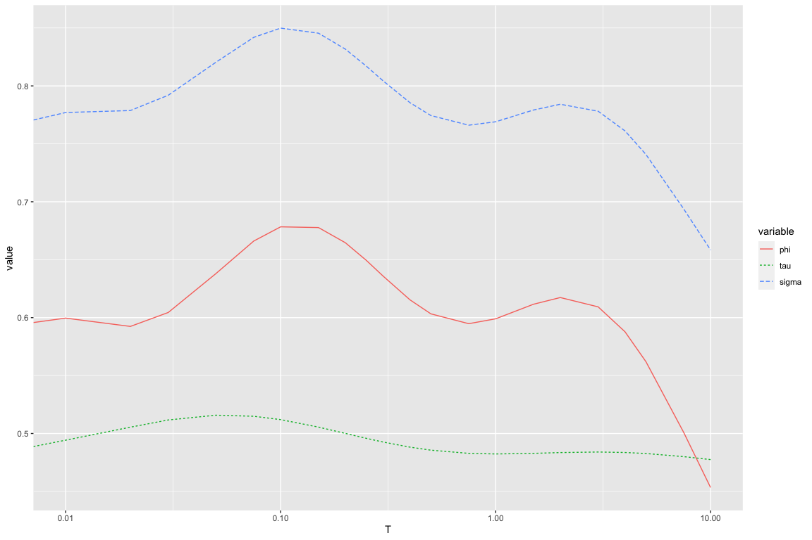
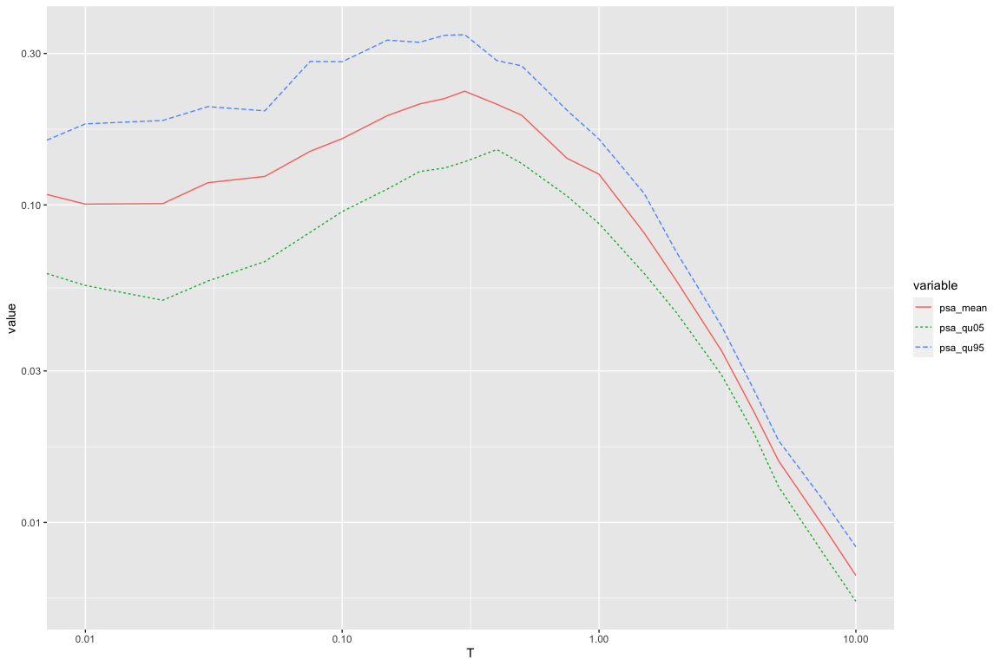

# Introduction

This is a demonstration of an implementation of the KBCG20 NGA subduction model.
The code can be run using the **R** programming language.
This code uses the updated Alaska coefficients from September 2021.

**Warning** The implementation is not meant for use in a productive PSHA code. It is not optimized for efficiency, and we do not provide checks that the inputs are reasonable and consistent. It is the users responsibility to ensure that the model is run with phsically meaningful inputs.

# Set Up

First, we load the needed libraries.


```r
# load required packages
library(MASS)
library(ggplot2)
library(reshape2)
library(dplyr)

# the following packages are needed to calculate the intersection points for forearc/backarc scaling
#library(rgeos)
#library(sp)
#library(maptools)
#library(raster)
#library(grDevices)
```

# Define Functions

## Helper Functions
First, some functions that are needed to do some internal calculations.


```{.r .numberLines}
# logistc hinge function
loghinge <- function(x, x0, a, b0, b1, delta) {
  return(a + b0 * (x - x0) + (b1 - b0) * delta * log(1 + exp((x - x0)/delta)))
}

# interpolation of adjustment to magnitude break point
# adjustment is only done for Japan and South America
interp_dmb <- function(period, reg) {
  if(reg == 4 || reg == 6) {
    ap <- approxfun(c(log(0.01),log(1),log(3),log(10)), c(0,0,-0.4,-0.4), rule = 2)
  
    if(period == 0 || period == -1) {
      return (ap(log(0.01)))
    } else {
      return (ap(log(period)))
    }
  } else {
    return (0)
  }
}

# interpolation of k1/k2 (values taken from Campbell and Bozorgnia (2014)
interp_k1k2 <- function(period) {
  periods <- c(0.005, 0.01, 0.02, 0.03, 0.05, 0.075, 0.1, 0.15, 0.2, 0.25, 0.3, 0.4, 0.5, 0.75,
               1., 1.5, 2., 3., 4., 5., 7.5, 10.)
  k1 <- c(865., 865., 865., 908., 1054., 1086., 1032., 878., 748., 654., 587., 503., 457., 410.,
          400., 400., 400., 400., 400., 400., 400., 400.)
  k2 <- c(-1.186, -1.186, -1.219, -1.273, -1.346, -1.471, -1.624, -1.931, -2.188, -2.381, -2.518,
          -2.657, -2.669, -2.401, -1.955, -1.025, -0.299, 0., 0., 0., 0., 0.)
  
  ap_k1 <- approxfun(log(periods), k1, rule = 2)
  ap_k2 <- approxfun(log(periods), k2, rule = 2)
  
  if(period == -1) {
    return(c(400., -1.955))
  } else if(period == 0) {
    return (c(ap_k1(log(0.005)),ap_k2(log(0.005))))
  } else {
    return (c(ap_k1(log(period)),ap_k2(log(period))))
  }
}

# funcation to calculate Z_1/Z_2_5 from Vs30
calc_z_from_vs <- function(vs, coeffs) {
  ln_zref <- coeffs[1] + (coeffs[2] - coeffs[1]) * exp((log(vs) - coeffs[3]) / coeffs[4]) / 
    (1 + exp((log(vs) - coeffs[3]) / coeffs[4]))
  
  return (ln_zref)
}
```

## Function to calculate median prediction

The following function calculates the median prediction of KBCG20, as described in chapter 4 of the PEER report.
It takes as input the predictor variables, as well as a set of coefficients.
Later, we define a function that acts as a wrapper around this function, and will take as input period, region index, and then select the appropriate coefficients and pass them on.

The inputs are

* `m`: moment magnitude
* `rlist`: a vector of length 3, which contains the distances in subregion 1,2,3 relative to volcanic arc; `rlist <- c(R1,R2,R3)`. For regions Alaska, Cascadia, New Zealand, and Taiwan, $R1 = R3 = 0$.
* `ztor`: depth to top of rupture in km.
* `fs`: flag for interface (`fs <- 0`) and intraslab (`fs <- 1`). Must be 0 or 1.
* `vs`: $V_{S30}$ n m/s.
* `fx`: arc crossing flag. Must be 0 or 1.
* `delta_ln_z`: difference between natural log of observed Z1.0/Z2.5 value and reference Z1.0/Z2.5 from $V_{S30}$.
* `coeffs`: vector containing coefficients needed to calculate median prediction.
* `coeffs_attn`: vector of length 6 to calcualte anelastic attenuation.
* `mbreak` and `zbreak`: magnitude and depth scaling break point
* `k1` and `k2`: parameters needed for site amplification
* `nft1` and `nft2`: coefficients needed for pseudo-depth term.
* `pgarock`: median pga prediction at $V_{S30} = 1100$


```{.r .numberLines}
# function to calculate median prediction
kbcg20_med <- function(m, rlist, ztor, fs, vs, fx, delta_ln_z, coeffs, coeffs_attn, coeffs_z, mbreak, zbreak, 
                        k1, k2, nft, pgarock) {
  
  rrup <- sum(rlist)
  # fixed coefficients
  theta10 <- 0;
  vsrock <- 1100;
  c <- 1.88;
  n <- 1.18;
  minmb <- 6.;
  delta <- 0.1;
  deltaz <- 1;
  refzif <- 15;
  refzslab <- 50;
  
  nft1 <- nft[1]
  nft2 <- nft[2]
  
  
  fmag <- (1 - fs) * loghinge(m, mbreak, coeffs[6] * (mbreak - minmb), coeffs[6], coeffs[8], delta) + 
         fs * loghinge(m, mbreak, coeffs[7] * (mbreak - minmb), coeffs[7], coeffs[8], delta)
  
  fgeom <- (1 - fs) * (coeffs[3] + coeffs[5] * m) * log(rrup + 10^(nft1 + nft2 * (m - 6)))
  fgeom_slab <- fs * (coeffs[4] + coeffs[5] * m) * log(rrup + 10^(nft1 + nft2 * (m - 6)))
  
  fdepth <- (1 - fs) * loghinge(ztor, zbreak, coeffs[12] * (zbreak - refzif), coeffs[12], theta10, deltaz) + 
           fs * loghinge(ztor, zbreak, coeffs[13] * (zbreak - refzslab), coeffs[13], theta10, deltaz)
  
  fattn <- fx * as.numeric(rlist %*% coeffs_attn[c(1,2,3)]) + (1 - fx) * as.numeric(rlist %*% coeffs_attn[c(4,5,6)]) + fx * coeffs[14]
  
  if(vs < k1) {
    fsite <- coeffs[11] * log(vs / k1) + k2 * (log(pgarock + c * (vs / k1)^n) - log(pgarock + c))
  } else {
    fsite <- (coeffs[11] + k2 * n) * log(vs/k1)
  }
  
  fbasin <- coeffs_z[1] + coeffs_z[2] * delta_ln_z
  
  median <- (1 - fs) * coeffs[1] + fs * coeffs[2] + fmag + fgeom + fgeom_slab + fdepth + fattn + fsite + fbasin;
  return(median)
}
```

## Function to calculate median prediction for a given scenario and period
This is a function that calculates median predictions of KBCG20 for a given scenario.
I takes as input period, the predictor variables for the scenarios, selects the appropriate coefficients/parameters, and calls the function defined in the previous section.

The arguments are similar to the function before.

* `m`: moment magnitude
* `rrup`: Rupture distance
* `ztor`: depth to top of rupture in km.
* `fs`: flag for interface (`fs <- 0`) and intraslab (`fs <- 1`). Must be 0 or 1.
* `vs`: $V_{S30}$ n m/s.
* `z_1`: depth to a shear wave horizon of 1000 m/s, in m. Used for regions Alaska and New Zealand.
* `z_2_5`: depth to a shear wave horizon of 2500 m/s, in m. Used for regions Cascadia and Japan.
* `mb`: Magnitude scaling break point. Should be set regionally dependent based on Campbell (2020).

The last input is a region index `reg`, which is as follows:

* 0: global
* 1: Alaska
* 2: Cascadia
* 3: Central America & Mexico
* 4: Japan
* 5: New Zealand
* 6: South America
* 7: Taiwan

The opional argument `Seattle_Basin` is a flag that should be set to `TRUE` if the site is in the Seattle Basin, and `FALSE` otherwise.
This flag determines which basin depth amplification model is used for Cascadia.
It does not have an impact on any other region.

The optional arguments `FractionBackArc` and `FractionNankai` specify the fraction of path that is in the backarc and the Nankai region, respectively.
Their values must be between 0 and 1.
The `FractionBackArc` flag is only used for CenralAmerica & Mexico, South America, and Japan; `FractionNankai` is only used for Japan.

The magnitude break points should depend on the geometry of the subducting slab.
Section 8 in the report describes how they should be set.
Default values are shown in the following table.
These values are asscociated with considerable uncertainty.


```
## Warning: package 'knitr' was built under R version 4.0.2
```


Table: Magnitude Break points

|Region                  |Subregion         | Mb_if| Mb_slab|
|:-----------------------|:-----------------|-----:|-------:|
|0_global                |Global            |   7.9|     7.6|
|1_Alaska                |Aleutian          |   8.0|     8.0|
|1_Alaska                |Alaska            |   8.6|     7.2|
|2_Cascadia              |Cascadia          |   8.0|     7.2|
|3_CentralAmerica&Mexico |Central_America_S |   7.5|     7.6|
|3_CentralAmerica&Mexico |Central_America_N |   7.4|     7.4|
|4_Japan                 |Japan_Pac         |   8.5|     7.6|
|4_Japan                 |Japan_Phi         |   7.7|     7.6|
|5_NewZealand            |New_Zealand_N     |   8.3|     7.6|
|5_NewZealand            |New_Zealand_S     |   8.0|     7.6|
|6_SouthAmerica          |South_America_N   |   8.5|     7.3|
|6_SouthAmerica          |South_America_S   |   8.6|     7.2|
|7_Taiwan                |Taiwan_W          |   7.1|     7.7|
|7_Taiwan                |Taiwan_E          |   7.1|     7.7|


```{.r .numberLines}
# function to calculate median prediction using mean coefficients
kbcg20 <- function(period, m, rrup, ztor, fs, vs, z_1, z_2_5, mb, reg, Seattle_Basin = FALSE, FractionBackArc = 0, FractionNankai = 0) {
  # need to add some checks for input (period, region)
  
  # coefficients to calculate zref from vs30
  pars_z_ja <- c(7.689368537500001, 2.302585092994046, 6.309186400000001, 0.7528670225000001, 1.2952369625)
  pars_z_casc <- c(8.294049640102028, 2.302585092994046, 6.396929655216146, 0.27081458999999997, 1.7381352625)
  pars_z_nz <- c(6.859789675000001, 2.302585092994046, 5.745692775, 0.91563524375, 1.03531412375)
  pars_z_tw <- c(6.30560665, 2.302585092994046, 6.1104992125, 0.43671101999999995, 0.7229702975000001)
  
  parameters <- read.csv('COEFFS_SEP21/coefficients_KBCG20.csv')
  
  # calculate distances within subregions
  if (reg == 3 || reg == 6) {
    r1 = FractionBackArc * rrup
    r3 = 0
  } else if (reg == 4) {
    r1 = FractionBackArc * rrup
    r3 = FractionNankai * rrup
  } else {
    r1 = 0
    r3 = 0
  }
  r2 = rrup - r1 - r3
  rlist = c(r1,r2,r3)
  
  # calculate arc crossing flag
  fx = 1
  if (r1 == 0 && r2 == 0) {
    fx = 0
  } else if (r1 == 0 && r3 == 0) {
    fx = 0
  } else if (r2 == 0 && r3 == 0) {
    fx = 0
  }
  
  # calculate rock PGA
  period_used <- 0.
  vsrock = 1100
  pars_period <- parameters[parameters$T == period_used,]
  coeffs_pga <- pars_period %>% dplyr::select(mu_theta_1_if:theta_6xc)
  k1k2 <- interp_k1k2(period_used)
  dmb <- interp_dmb(period_used, reg)
  
  delta_ln_z <- 0
  coeffs_z_pga <- c(0,0)
  coeffs_z_pga2 <- c(0,0)
  
  if(reg == 1) {
    coeffs_pga[c(1,2,11)] <- pars_period %>% dplyr::select(theta_1_if_reg_Al,theta_1_slab_reg_Al,theta_7_reg_Al)
    coeffs_attn_pga <- pars_period %>% dplyr::select(theta_6_x1_reg_Al, theta_6_x2_reg_Al, theta_6_x3_reg_Al,
                                         theta_6_1_reg_Al, theta_6_2_reg_Al, theta_6_3_reg_Al)
  } else if(reg == 2) {
    coeffs_pga[c(1,2,11)] <- pars_period %>% dplyr::select(theta_1_if_reg_Ca,theta_1_slab_reg_Ca,theta_7_reg_Ca)
    coeffs_attn_pga <- pars_period %>% dplyr::select(theta_6_x1_reg_Ca, theta_6_x2_reg_Ca, theta_6_x3_reg_Ca,
                                         theta_6_1_reg_Ca, theta_6_2_reg_Ca, theta_6_3_reg_Ca)
    coeffs_z_pga2 <- pars_period %>% dplyr::select(theta_11_Ca, theta_12_Ca)
    coeff_seattle <- pars_period %>% dplyr::select(mean_residual_Seattle_basin)
    if(Seattle_Basin) {
      coeffs_z_pga2 <- c(coeff_seattle,0)
    }
  } else if(reg == 3) {
    coeffs_pga[c(1,2,11)] <- pars_period %>% dplyr::select(theta_1_if_reg_CAM,theta_1_slab_reg_CAM,theta_7_reg_CAM)
    coeffs_attn_pga = coeffs_attn = pars_period %>% dplyr::select(theta_6_x1_reg_CAM, theta_6_x2_reg_CAM, theta_6_x3_reg_CAM,
                                                       theta_6_1_reg_CAM, theta_6_2_reg_CAM, theta_6_3_reg_CAM)
  } else if(reg == 4) {
    coeffs_pga[c(1,2,11)] <- pars_period %>% dplyr::select(theta_1_if_reg_Ja,theta_1_slab_reg_Ja,theta_7_reg_Ja)
    coeffs_attn_pga = pars_period %>% dplyr::select(theta_6_x1_reg_Ja, theta_6_x2_reg_Ja, theta_6_x3_reg_Ja,
                                                       theta_6_1_reg_Ja, theta_6_2_reg_Ja, theta_6_3_reg_Ja)
    coeffs_z_pga2 <- pars_period %>% dplyr::select(theta_11_Ja, theta_12_Ja)
  } else if(reg == 5) {
    coeffs_pga[c(1,2,11)] <- pars_period %>% dplyr::select(theta_1_if_reg_NZ,theta_1_slab_reg_NZ,theta_7_reg_NZ)
    coeffs_attn_pga = coeffs_attn = pars_period %>% dplyr::select(theta_6_x1_reg_NZ, theta_6_x2_reg_NZ, theta_6_x3_reg_NZ,
                                                       theta_6_1_reg_NZ, theta_6_2_reg_NZ, theta_6_3_reg_NZ)
    coeffs_z_pga2 <- pars_period %>% dplyr::select(theta_11_NZ, theta_12_NZ)
  } else if(reg == 6) {
    coeffs_pga[c(1,2,11)] <- pars_period %>% dplyr::select(theta_1_if_reg_SA,theta_1_slab_reg_SA,theta_7_reg_SA)
    coeffs_attn_pga = pars_period %>% dplyr::select(theta_6_x1_reg_SA, theta_6_x2_reg_SA, theta_6_x3_reg_SA,
                                                       theta_6_1_reg_SA, theta_6_2_reg_SA, theta_6_3_reg_SA)
  } else if(reg == 7) {
    coeffs_pga[c(1,2,11)] <- pars_period %>% dplyr::select(theta_1_if_reg_Tw,theta_1_slab_reg_Tw,theta_7_reg_Tw)
    coeffs_attn_pga  = pars_period %>% dplyr::select(theta_6_x1_reg_Tw, theta_6_x2_reg_Tw, theta_6_x3_reg_Tw,
                                                       theta_6_1_reg_Tw, theta_6_2_reg_Tw, theta_6_3_reg_Tw)
    coeffs_z_pga2 <- pars_period %>% dplyr::select(theta_11_Tw, theta_12_Tw)
  } else if(reg == 0) {
    theta_6 <- pars_period$mu_theta_6
    theta_6b <- pars_period$mu_theta_6b
    coeffs_attn_pga <- c(theta_6b, theta_6b, theta_6b, theta_6b, theta_6, theta_6)
  }
  
  
  delta_bz <- as.numeric(pars_period %>% dplyr::select(dzb_if, dzb_slab))
  coeffs_nft_pga <- as.numeric(pars_period %>% dplyr::select(nft_1, nft_2))
  
  mbreak_pga <- (1 - fs) * (mb + dmb) + fs * mb
  zbreak_pga <- (1 - fs) * (30 + delta_bz[1]) + fs * (80 + delta_bz[2])
  k1k2_pga <- k1k2
  
  coeffs_pga <- as.numeric(coeffs_pga)
  coeffs_attn_pga <- as.numeric(coeffs_attn_pga)
  coeffs_z_pga2 <- as.numeric(coeffs_z_pga2)
  
  pgarock <- exp(kbcg20_med(m, rlist, ztor, fs, vsrock, fx, delta_ln_z, coeffs_pga, coeffs_attn_pga,
                            coeffs_z_pga, mbreak_pga, zbreak_pga, k1k2_pga[1], k1k2_pga[2], coeffs_nft_pga, 0))
  
  
  # calculate PSA
  period_used <- period
  pars_period <- parameters[parameters$T == period_used,]
  coeffs <- pars_period %>% dplyr::select(mu_theta_1_if:theta_6xc)
  k1k2 <- interp_k1k2(period_used)
  dmb <- interp_dmb(period_used, reg)
  
  delta_ln_z <- 0
  coeffs_z <- c(0,0)
  
  if(reg == 1) {
    coeffs[c(1,2,11)] <- pars_period %>% dplyr::select(theta_1_if_reg_Al,theta_1_slab_reg_Al,theta_7_reg_Al)
    coeffs_attn <- pars_period %>% dplyr::select(theta_6_x1_reg_Al, theta_6_x2_reg_Al, theta_6_x3_reg_Al,
                                         theta_6_1_reg_Al, theta_6_2_reg_Al, theta_6_3_reg_Al)
  } else if(reg == 2) {
    coeffs[c(1,2,11)] <- pars_period %>% dplyr::select(theta_1_if_reg_Ca,theta_1_slab_reg_Ca,theta_7_reg_Ca)
    coeffs_attn <- pars_period %>% dplyr::select(theta_6_x1_reg_Ca, theta_6_x2_reg_Ca, theta_6_x3_reg_Ca,
                                         theta_6_1_reg_Ca, theta_6_2_reg_Ca, theta_6_3_reg_Ca)
    delta_ln_z <- log(z_2_5) - calc_z_from_vs(vs, pars_z_casc)
    coeffs_z <- pars_period %>% dplyr::select(theta_11_Ca, theta_12_Ca)
    coeff_seattle <- pars_period %>% dplyr::select(mean_residual_Seattle_basin)
    if(Seattle_Basin) {
      coeffs_z <- c(coeff_seattle,0)
    }
  } else if(reg == 3) {
    coeffs[c(1,2,11)] <- pars_period %>% dplyr::select(theta_1_if_reg_CAM,theta_1_slab_reg_CAM,theta_7_reg_CAM)
    coeffs_attn <- pars_period %>% dplyr::select(theta_6_x1_reg_CAM, theta_6_x2_reg_CAM, theta_6_x3_reg_CAM,
                                         theta_6_1_reg_CAM, theta_6_2_reg_CAM, theta_6_3_reg_CAM)
  } else if(reg == 4) {
    coeffs[c(1,2,11)] <- pars_period %>% dplyr::select(theta_1_if_reg_Ja,theta_1_slab_reg_Ja,theta_7_reg_Ja)
    coeffs_attn <- pars_period %>% dplyr::select(theta_6_x1_reg_Ja, theta_6_x2_reg_Ja, theta_6_x3_reg_Ja,
                                         theta_6_1_reg_Ja, theta_6_2_reg_Ja, theta_6_3_reg_Ja)
    delta_ln_z <- log(z_2_5) - calc_z_from_vs(vs, pars_z_ja)
    coeffs_z <- pars_period %>% dplyr::select(theta_11_Ja, theta_12_Ja)
  } else if(reg == 5) {
    coeffs[c(1,2,11)] <- pars_period %>% dplyr::select(theta_1_if_reg_NZ,theta_1_slab_reg_NZ,theta_7_reg_NZ)
    coeffs_attn <- pars_period %>% dplyr::select(theta_6_x1_reg_NZ, theta_6_x2_reg_NZ, theta_6_x3_reg_NZ,
                                         theta_6_1_reg_NZ, theta_6_2_reg_NZ, theta_6_3_reg_NZ)
    delta_ln_z <- log(z_1) - calc_z_from_vs(vs, pars_z_nz)
    coeffs_z <- pars_period %>% dplyr::select(theta_11_NZ, theta_12_NZ)
  } else if(reg == 6) {
    coeffs[c(1,2,11)] <- pars_period %>% dplyr::select(theta_1_if_reg_SA,theta_1_slab_reg_SA,theta_7_reg_SA)
    coeffs_attn <- pars_period %>% dplyr::select(theta_6_x1_reg_SA, theta_6_x2_reg_SA, theta_6_x3_reg_SA,
                                         theta_6_1_reg_SA, theta_6_2_reg_SA, theta_6_3_reg_SA)
  } else if(reg == 7) {
    coeffs[c(1,2,11)] <- pars_period %>% dplyr::select(theta_1_if_reg_Tw,theta_1_slab_reg_Tw,theta_7_reg_Tw)
    coeffs_attn <- pars_period %>% dplyr::select(theta_6_x1_reg_Tw, theta_6_x2_reg_Tw, theta_6_x3_reg_Tw,
                                         theta_6_1_reg_Tw, theta_6_2_reg_Tw, theta_6_3_reg_Tw)
    delta_ln_z <- log(z_1) - calc_z_from_vs(vs, pars_z_tw)
    coeffs_z <- pars_period %>% dplyr::select(theta_11_Tw, theta_12_Tw)
  } else if(reg == 0) {
    theta_6 <- pars_period$mu_theta_6
    theta_6b <- pars_period$mu_theta_6b
    coeffs_attn <- c(theta_6b, theta_6b, theta_6b, theta_6b, theta_6, theta_6)
  }
  
  delta_bz <- as.numeric(pars_period %>% dplyr::select(dzb_if, dzb_slab))
  coeffs_nft <- as.numeric(pars_period %>% dplyr::select(nft_1, nft_2))
  
  coeffs <- as.numeric(coeffs)
  coeffs_attn <- as.numeric(coeffs_attn)
  coeffs_z <- as.numeric(coeffs_z)
  
  mbreak <- (1 - fs) * (mb + dmb) + fs * mb
  zbreak <- (1 - fs) * (30 + delta_bz[1]) + fs * (80 + delta_bz[2])
  
  med_pga <- kbcg20_med(m, rlist, ztor, fs, vs, fx, delta_ln_z, coeffs_pga, coeffs_attn_pga, coeffs_z_pga2,
                        mbreak_pga, zbreak_pga, k1k2_pga[1], k1k2_pga[2], coeffs_nft_pga, pgarock)
  
  med <- kbcg20_med(m, rlist, ztor, fs, vs, fx, delta_ln_z, coeffs, coeffs_attn, coeffs_z, mbreak, zbreak, 
                    k1k2[1], k1k2[2], coeffs_nft, pgarock)

  
  if(med < med_pga && period <= 0.1) {
    med <- med_pga
  }
  
  phi <- pars_period$phi
  tau <- pars_period$tau
  
  result <- (list(median = med, phi = phi, tau = tau))
  return(result)
}
```


## Function to calculate distribution of median predictions (for epistemic uncertainty)

This function is similar as the one in the previous section, but reads in posterior distribution, and loops over samples from posterior.
The number of samples can be set, with 800 as default.
Output is mean/median/5%,25%,75%,95% quntiles of distribution, and the median predictions themselves.

Two functions are defined.
The first calculates predictions for the global model using presampled adjustment coefficients for a new region, while the second one samples these internally
The second function is implemented to demonstrate how to perform the sampling, (how to calculate the covariance matrix from the `output of the cholesky decomposition).
To get reproducible results, one should use the function with presampled global coefficients.


```{.r .numberLines}
# function to calculate median prediction using posterior distributions
kbcg20_posterior <- function(period, m, rrup, ztor, fs, vs, z_1, z_2_5, mb, reg, num_samples = 100, Seattle_Basin = FALSE, FractionBackArc = 0, FractionNankai = 0) {
  # need to add some checks for input (period, region)
  
  # coefficients to calculate zref from vs30
  pars_z_ja <- c(7.689368537500001, 2.302585092994046, 6.309186400000001, 0.7528670225000001, 1.2952369625)
  pars_z_casc <- c(8.294049640102028, 2.302585092994046, 6.396929655216146, 0.27081458999999997, 1.7381352625)
  pars_z_nz <- c(6.859789675000001, 2.302585092994046, 5.745692775, 0.91563524375, 1.03531412375)
  pars_z_tw <- c(6.30560665, 2.302585092994046, 6.1104992125, 0.43671101999999995, 0.7229702975000001)
  
  parameters <- read.csv('COEFFS_SEP21/coefficients_KBCG20.csv')
  
  # calculate distances within subregions
  if (reg == 3 || reg == 6) {
    r1 = FractionBackArc * rrup
    r3 = 0
  } else if (reg == 4) {
    r1 = FractionBackArc * rrup
    r3 = FractionNankai * rrup
  } else {
    r1 = 0
    r3 = 0
  }
  r2 = rrup - r1 - r3
  rlist = c(r1,r2,r3)
  
  # calculate arc crossing flag
  fx = 1
  if (r1 == 0 && r2 == 0) {
    fx = 0
  } else if (r1 == 0 && r3 == 0) {
    fx = 0
  } else if (r2 == 0 && r3 == 0) {
    fx = 0
  }
  
  # calculate rock PGA
  period_used <- 0.
  vsrock <- 1100
  pars_period <- parameters[parameters$T == period_used,]
  coeffs <- pars_period %>% dplyr::select(mu_theta_1_if:theta_6xc)
  k1k2 <- interp_k1k2(period_used)
  dmb <- interp_dmb(period_used, reg)

  delta_ln_z <- 0
  coeffs_z <- c(0,0)
  
  if(reg == 1) {
    coeffs[c(1,2,11)] <- pars_period %>% dplyr::select(theta_1_if_reg_Al,theta_1_slab_reg_Al,theta_7_reg_Al)
    coeffs_attn <- pars_period %>% dplyr::select(theta_6_x1_reg_Al, theta_6_x2_reg_Al, theta_6_x3_reg_Al,
                                         theta_6_1_reg_Al, theta_6_2_reg_Al, theta_6_3_reg_Al)
  } else if(reg == 2) {
    coeffs[c(1,2,11)] <- pars_period %>% dplyr::select(theta_1_if_reg_Ca,theta_1_slab_reg_Ca,theta_7_reg_Ca)
    coeffs_attn <- pars_period %>% dplyr::select(theta_6_x1_reg_Ca, theta_6_x2_reg_Ca, theta_6_x3_reg_Ca,
                                         theta_6_1_reg_Ca, theta_6_2_reg_Ca, theta_6_3_reg_Ca)
  } else if(reg == 3) {
    coeffs[c(1,2,11)] <- pars_period %>% dplyr::select(theta_1_if_reg_CAM,theta_1_slab_reg_CAM,theta_7_reg_CAM)
    coeffs_attn = coeffs_attn = pars_period %>% dplyr::select(theta_6_x1_reg_CAM, theta_6_x2_reg_CAM, theta_6_x3_reg_CAM,
                                                       theta_6_1_reg_CAM, theta_6_2_reg_CAM, theta_6_3_reg_CAM)
  } else if(reg == 4) {
    coeffs[c(1,2,11)] <- pars_period %>% dplyr::select(theta_1_if_reg_Ja,theta_1_slab_reg_Ja,theta_7_reg_Ja)
    coeffs_attn = pars_period %>% dplyr::select(theta_6_x1_reg_Ja, theta_6_x2_reg_Ja, theta_6_x3_reg_Ja,
                                                       theta_6_1_reg_Ja, theta_6_2_reg_Ja, theta_6_3_reg_Ja)
  } else if(reg == 5) {
    coeffs[c(1,2,11)] <- pars_period %>% dplyr::select(theta_1_if_reg_NZ,theta_1_slab_reg_NZ,theta_7_reg_NZ)
    coeffs_attn = coeffs_attn = pars_period %>% dplyr::select(theta_6_x1_reg_NZ, theta_6_x2_reg_NZ, theta_6_x3_reg_NZ,
                                                       theta_6_1_reg_NZ, theta_6_2_reg_NZ, theta_6_3_reg_NZ)
  } else if(reg == 6) {
    coeffs[c(1,2,11)] <- pars_period %>% dplyr::select(theta_1_if_reg_SA,theta_1_slab_reg_SA,theta_7_reg_SA)
    coeffs_attn = pars_period %>% dplyr::select(theta_6_x1_reg_SA, theta_6_x2_reg_SA, theta_6_x3_reg_SA,
                                                       theta_6_1_reg_SA, theta_6_2_reg_SA, theta_6_3_reg_SA)
  } else if(reg == 7) {
    coeffs[c(1,2,11)] <- pars_period %>% dplyr::select(theta_1_if_reg_Tw,theta_1_slab_reg_Tw,theta_7_reg_Tw)
    coeffs_attn  = pars_period %>% dplyr::select(theta_6_x1_reg_Tw, theta_6_x2_reg_Tw, theta_6_x3_reg_Tw,
                                                       theta_6_1_reg_Tw, theta_6_2_reg_Tw, theta_6_3_reg_Tw)
  } else if(reg == 0) {
    theta_6 <- pars_period$mu_theta_6
    theta_6b <- pars_period$mu_theta_6b
    coeffs_attn <- c(theta_6b, theta_6b, theta_6b, theta_6b, theta_6, theta_6)
  }
  
  delta_bz <- as.numeric(pars_period %>% dplyr::select(dzb_if, dzb_slab))
  coeffs_nft <- as.numeric(pars_period %>% dplyr::select(nft_1, nft_2))
  
  coeffs <- as.numeric(coeffs)
  coeffs_attn <- as.numeric(coeffs_attn)
  
  mbreak <- (1 - fs) * (mb + dmb) + fs * mb
  zbreak <- (1 - fs) * (30 + delta_bz[1]) + fs * (80 + delta_bz[2])
  
  pgarock <- exp(kbcg20_med(m, rlist, ztor, fs, vsrock, fx, delta_ln_z, coeffs, coeffs_attn, coeffs_z, mbreak, zbreak, 
                            k1k2[1], k1k2[2], coeffs_nft, 0))
  
  
  # calculate PSA
  period_used <- period
  parameters_posterior <- read.csv(sprintf('COEFFS_SEP21/posterior_coefficients_KBCG20_T%06.3f.csv',period_used))
  k1k2 <- interp_k1k2(period_used)
  dmb <- interp_dmb(period_used, reg)
  
  med_predictions <- matrix(nrow = num_samples, ncol = 1)
  
  for(k in 1:num_samples) {
    pars_period <- parameters_posterior[k,]
    coeffs <- pars_period[seq(2,15)]
    
    delta_ln_z <- 0
    coeffs_z <- c(0,0)
  
    if(reg == 1) {
      coeffs[c(1,2,11)] <- pars_period %>% dplyr::select(theta_1_if_reg_Al,theta_1_slab_reg_Al,theta_7_reg_Al)
      coeffs_attn <- pars_period %>% dplyr::select(theta_6_x1_reg_Al, theta_6_x2_reg_Al, theta_6_x3_reg_Al,
                                           theta_6_1_reg_Al, theta_6_2_reg_Al, theta_6_3_reg_Al)
      } else if(reg == 2) {
      coeffs[c(1,2,11)] <- pars_period %>% dplyr::select(theta_1_if_reg_Ca,theta_1_slab_reg_Ca,theta_7_reg_Ca)
      coeffs_attn <- pars_period %>% dplyr::select(theta_6_x1_reg_Ca, theta_6_x2_reg_Ca, theta_6_x3_reg_Ca,
                                           theta_6_1_reg_Ca, theta_6_2_reg_Ca, theta_6_3_reg_Ca)
      delta_ln_z <- log(z_2_5) - calc_z_from_vs(vs, pars_z_casc)
      coeffs_z <- pars_period %>% dplyr::select(theta_11_Ca, theta_12_Ca)
      coeff_seattle <- pars_period %>% dplyr::select(mean_residual_Seattle_basin)
      if(Seattle_Basin) {
        coeffs_z <- c(coeff_seattle,0)
      }
    } else if(reg == 3) {
      coeffs[c(1,2,11)] <- pars_period %>% dplyr::select(theta_1_if_reg_CAM,theta_1_slab_reg_CAM,theta_7_reg_CAM)
      coeffs_attn <- pars_period %>% dplyr::select(theta_6_x1_reg_CAM, theta_6_x2_reg_CAM, theta_6_x3_reg_CAM,
                                           theta_6_1_reg_CAM, theta_6_2_reg_CAM, theta_6_3_reg_CAM)
    } else if(reg == 4) {
      coeffs[c(1,2,11)] <- pars_period %>% dplyr::select(theta_1_if_reg_Ja,theta_1_slab_reg_Ja,theta_7_reg_Ja)
      coeffs_attn <- pars_period %>% dplyr::select(theta_6_x1_reg_Ja, theta_6_x2_reg_Ja, theta_6_x3_reg_Ja,
                                           theta_6_1_reg_Ja, theta_6_2_reg_Ja, theta_6_3_reg_Ja)
      delta_ln_z <- log(z_2_5) - calc_z_from_vs(vs, pars_z_ja)
      coeffs_z <- pars_period %>% dplyr::select(theta_11_Ja, theta_12_Ja)
    } else if(reg == 5) {
      coeffs[c(1,2,11)] <- pars_period %>% dplyr::select(theta_1_if_reg_NZ,theta_1_slab_reg_NZ,theta_7_reg_NZ)
      coeffs_attn <- pars_period %>% dplyr::select(theta_6_x1_reg_NZ, theta_6_x2_reg_NZ, theta_6_x3_reg_NZ,
                                           theta_6_1_reg_NZ, theta_6_2_reg_NZ, theta_6_3_reg_NZ)
      delta_ln_z <- log(z_1) - calc_z_from_vs(vs, pars_z_nz)
      coeffs_z <- pars_period %>% dplyr::select(theta_11_NZ, theta_12_NZ)
    } else if(reg == 6) {
      coeffs[c(1,2,11)] <- pars_period %>% dplyr::select(theta_1_if_reg_SA,theta_1_slab_reg_SA,theta_7_reg_SA)
      coeffs_attn <- pars_period %>% dplyr::select(theta_6_x1_reg_SA, theta_6_x2_reg_SA, theta_6_x3_reg_SA,
                                           theta_6_1_reg_SA, theta_6_2_reg_SA, theta_6_3_reg_SA)
    } else if(reg == 7) {
      coeffs[c(1,2,11)] <- pars_period %>% dplyr::select(theta_1_if_reg_Tw,theta_1_slab_reg_Tw,theta_7_reg_Tw)
      coeffs_attn <- pars_period %>% dplyr::select(theta_6_x1_reg_Tw, theta_6_x2_reg_Tw, theta_6_x3_reg_Tw,
                                           theta_6_1_reg_Tw, theta_6_2_reg_Tw, theta_6_3_reg_Tw)
      delta_ln_z <- log(z_1) - calc_z_from_vs(vs, pars_z_tw)
      coeffs_z <- pars_period %>% dplyr::select(theta_11_Tw, theta_12_Tw)
    } else if(reg == 0) {
      coeffs[c(1,2,11)] <- pars_period %>% dplyr::select(theta_1_if_reg_global, theta_1_slab_reg_global,
                                                  theta_7_reg_global)
      coeffs_attn <- pars_period %>% dplyr::select(theta_6_x1_reg_global, theta_6_x2_reg_global, theta_6_x3_reg_global,
                                           theta_6_1_reg_global, theta_6_2_reg_global, theta_6_3_reg_global)
    }
    
    
    delta_bz <- as.numeric(pars_period %>% dplyr::select(dzb_if, dzb_slab))
    coeffs_nft <- as.numeric(pars_period %>% dplyr::select(nft_1, nft_2))
    
    coeffs <- as.numeric(coeffs)
    coeffs_attn <- as.numeric(coeffs_attn)
    coeffs_z <- as.numeric(coeffs_z)
  
    mbreak <-(1 - fs) * (mb + dmb) + fs * mb
    zbreak <-(1 - fs) * (30 + delta_bz[1]) + fs * (80 + delta_bz[2])
  
    med <- kbcg20_med(m, rlist, ztor, fs, vs, fx, delta_ln_z, coeffs, coeffs_attn, coeffs_z, mbreak, zbreak, 
                      k1k2[1], k1k2[2], coeffs_nft, pgarock)
    med_predictions[k] <- med
  }
  result <- list(mean = mean(med_predictions), median = median(med_predictions), psi = sd(med_predictions),
                 qu_05 = as.numeric(quantile(med_predictions,0.05)), qu_25 = as.numeric(quantile(med_predictions,0.25)),
                 qu_75 = as.numeric(quantile(med_predictions,0.75)), qu_95 = as.numeric(quantile(med_predictions,0.95)),
                 samples = med_predictions)
  return(result)
}
```


# Example calculations


```r
periods <- c(0., 0.01, 0.02, 0.03, 0.05, 0.075, 0.1, 0.15, 0.2, 0.25, 0.3, 0.4, 0.5, 0.75, 1., 1.5, 2., 3., 4., 5., 7.5, 10.)
per <- -1
mag <- 8
rrup <- 100
distance <- c(0,100,0)
ztor <- 10
fs <- 0
vs30 <- 400
z1 <- 550
z2 <- 4000
fx <- 0
mb <- 8.
reg_idx <- 0
frac_ba <- 0
frac_nankai <- 0
y_post <- kbcg20_posterior(per, mag, rrup, ztor, fs, vs30, z1, z2, mb, reg_idx, num_samples = 400, FractionBackArc = frac_ba, FractionNankai = frac_nankai)
y <- kbcg20(per, mag, rrup, ztor, fs, vs30, z1, z2, mb, reg_idx, FractionBackArc = frac_ba, FractionNankai = frac_nankai)

spectrum <- matrix(nrow = length(periods), ncol = 4)
for(k in 1:length(periods)) {
 pred = kbcg20(periods[k], mag, rrup, ztor, fs, vs30, z1, z2, mb, reg_idx, FractionBackArc = frac_ba, FractionNankai = frac_nankai)
 spectrum[k,] <- c(pred$median, pred$phi, pred$tau, sqrt(pred$phi^2 + pred$tau^2))
}

sprintf('median prediction from mean of coefficients: %f',y$median)
```

```
## [1] "median prediction from mean of coefficients: 2.439532"
```

```r
sprintf('phi: %f',y$phi)
```

```
## [1] "phi: 0.511486"
```

```r
sprintf('tau: %f',y$tau)
```

```
## [1] "tau: 0.450985"
```

```r
sprintf('mean of median predictions: %f',y_post$mean)
```

```
## [1] "mean of median predictions: 2.431268"
```

```r
sprintf('median of median predictions: %f',y_post$median)
```

```
## [1] "median of median predictions: 2.440602"
```

```r
sprintf('standard deviation of median predictions: %f',y_post$psi)
```

```
## [1] "standard deviation of median predictions: 0.143551"
```

```r
ggplot(as.data.frame(y_post), aes(x=samples)) + geom_histogram(aes(y=..density..),binwidth=0.05, color="black", fill="white") + geom_density(alpha=.2, fill="#FF6666")
```

<!-- -->

```r
df <- data.frame(T = periods, psa = as.vector(exp(spectrum[,1])))
p <- ggplot(df, aes(x = T, y = psa)) + geom_line()
p + scale_y_log10() + scale_x_log10()
```

```
## Warning: Transformation introduced infinite values in continuous x-axis
```

<!-- -->

```r
df <- data.frame(T = periods, phi = as.vector(spectrum[,2]), tau = as.vector(spectrum[,3]), sigma = as.vector(spectrum[,4]))
df.melt <- melt(df,id=1)
p <- ggplot(df.melt)+geom_line(aes(x=T, y=value, color=variable, linetype=variable))
p + scale_x_log10()
```

```
## Warning: Transformation introduced infinite values in continuous x-axis
```

<!-- -->

```r
spectrum_unc <- matrix(ncol = 6, nrow = length(periods))
for(k in 1:length(periods)) {
 spec <- kbcg20_posterior(periods[k], mag, rrup, ztor, fs, vs30, z1, z2, mb, reg_idx)
 spectrum_unc[k,] <- c(spec$mean, spec$median, spec$qu_05, spec$qu_25, spec$qu_75, spec$qu_95)
}
df <- data.frame(T = periods, psa_mean = exp(spectrum_unc[,1]), psa_qu05 = exp(spectrum_unc[,3]), psa_qu95 = exp(spectrum_unc[,6]))
df.melt <- melt(df,id=1)
p <- ggplot(df.melt)+geom_line(aes(x=T, y=value, color=variable, linetype=variable))
p + scale_y_log10() + scale_x_log10()
```

```
## Warning: Transformation introduced infinite values in continuous x-axis
```

<!-- -->

